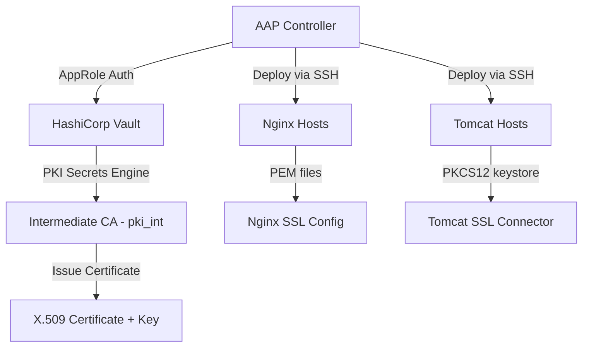
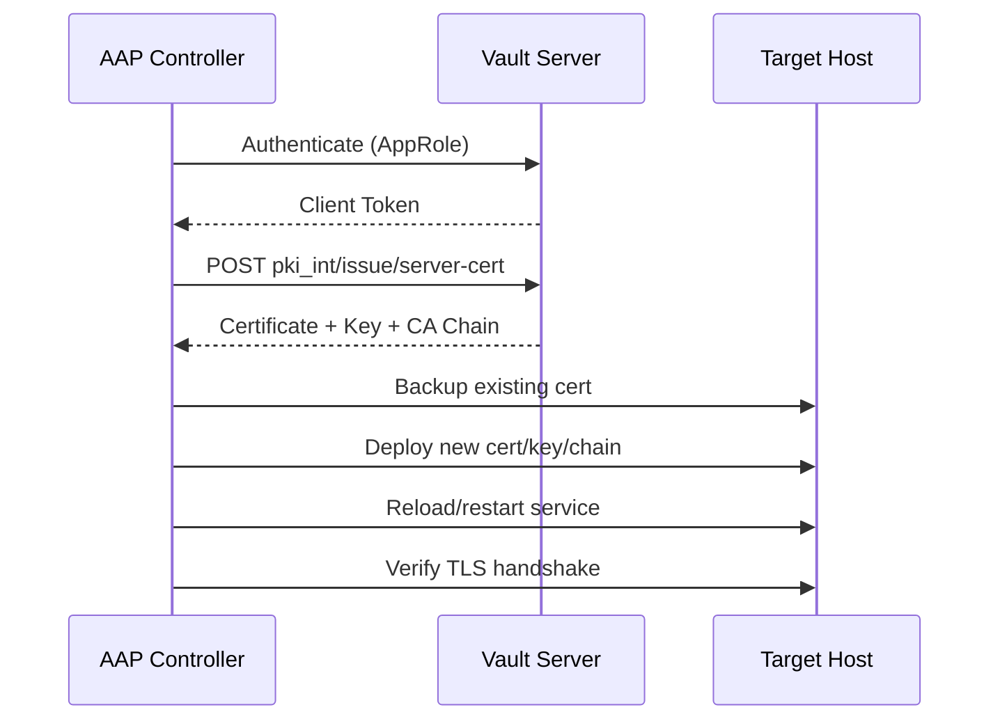
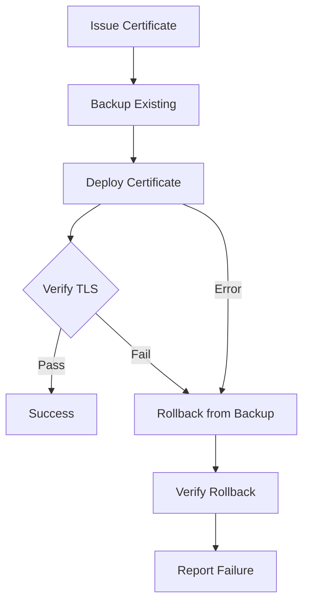

# Certificate Lifecycle Management -- Architecture

## Overview

This project automates X.509 certificate lifecycle management using HashiCorp Vault (PKI secrets engine) for certificate issuance and Ansible Automation Platform (AAP) for orchestrated deployment, verification, and remediation.

## Component Architecture



## Certificate Issuance Flow



## Deployment with Rollback



## Role Dependency Map

| Role | Purpose | Dependencies |
|------|---------|-------------|
| `vault_cert_issue` | Issue cert from Vault PKI | `community.hashi_vault` |
| `cert_backup` | Timestamped backup of existing certs | `community.crypto` |
| `cert_deploy` | Deploy cert + service-specific config | `community.crypto` (Tomcat PKCS12) |
| `cert_verify` | File checks + TLS handshake validation | `community.crypto` |
| `cert_monitor` | Read cert expiry, set renewal fact | `community.crypto` |
| `vault_cert_revoke` | Revoke cert by serial number | `community.hashi_vault` |
| `cert_rollback` | Restore from latest backup | `community.crypto` (Tomcat PKCS12) |

## Dispatcher Pattern (cert_deploy)

The `cert_deploy` role uses a dispatcher pattern for extensibility:

```
cert_deploy/tasks/main.yml          # Common: write cert/key/chain files
  └── deploy_{{ cert_service_type }}.yml
      ├── deploy_nginx.yml           # Nginx: fullchain, config test, reload
      └── deploy_tomcat.yml          # Tomcat: PEM->PKCS12, restart
```

Adding a new service type (e.g., Apache httpd):
1. Create `roles/cert_deploy/tasks/deploy_httpd.yml`
2. Create `group_vars/httpd.yml`
3. Add `httpd` group to `inventory/hosts.yml`

No changes needed to `main.yml` or existing service deploy files.

## Security Model

- **Authentication**: AAP to Vault via AppRole (role ID + secret ID as env vars)
- **Authorization**: Least-privilege Vault policy (`policies/aap_pki_policy.hcl`)
- **Secrets in transit**: `no_log: true` on all key-handling tasks
- **Secrets at rest**: Keystore passwords in Vault KV, not in repo
- **Blast radius**: `serial: 1` limits deployment to one host at a time
